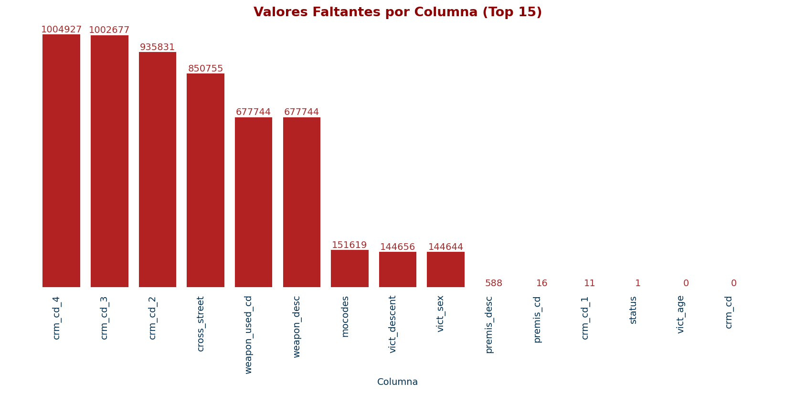

# Gráficos y Visualizaciones del Proyecto

Este documento presenta las principales visualizaciones generadas durante el análisis de delitos en Los Ángeles (2020-2025). Cada gráfico aporta información clave para interpretar los resultados y validar los modelos predictivos.

## Valores Faltantes por Columna (Top 15)

Visualización de la cantidad de valores nulos en las principales columnas para evaluar calidad de datos y áreas críticas para limpieza.

## Registros Antes vs Después de Limpieza Mínima

Comparativa del volumen de registros antes y después de aplicar filtros y limpieza, mostrando la reducción necesaria para garantizar datos confiables.

## Top 15 Tipos de Crimen

Distribución de los tipos de delitos más frecuentes en el dataset, destacando predominancia de agresiones simples y robos.

## Incidentes por Mes

Evolución temporal mensual del número de crímenes reportados, identificando tendencias y fluctuaciones estacionales.

## Incidentes por Día de la Semana (0 = Lunes)

Frecuencia de delitos según el día de la semana, evidenciando días con mayor concentración de crímenes violentos.

## Distribución de la Edad de Víctimas

Histograma de la edad de víctimas, mostrando que la población adulta es la más afectada por los delitos.

## Mapa de Calor de Correlaciones Numéricas

Relaciones entre variables numéricas que ayudan a entender dependencias y seleccionar variables para modelado.

## OLS: Observado vs. Predicho

Evaluación gráfica del ajuste del modelo de regresión lineal a la serie temporal de incidentes mensuales.

## OLS: Residuos vs. Tiempo

Patrones en residuos del modelo OLS para detectar posibles errores o tendencias no capturadas.

## Curva ROC - Regresión Logística

Desempeño del modelo logístico en la clasificación de crímenes violentos, ilustrado mediante la curva ROC y área bajo la curva.

## Curva ROC - Random Forest

Evaluación del modelo Random Forest con su curva ROC mostrando alta capacidad discriminativa.

## Matriz de Confusión - Random Forest

Visualización de la clasificación correcta e incorrecta del modelo Random Forest.

## Top 20 Importancias - Random Forest

Ranking de las variables más influyentes en el modelo Random Forest para entender factores determinantes.

## Curva del Codo - KMeans sobre PCA

Determinación del número óptimo de clusters (k=4) en el agrupamiento no supervisado.

## KMeans en Espacio PCA (k=4)

Visualización de los 4 clusters identificados en el espacio de componentes principales.

## Serie Mensual de Incidentes

Gráfico de línea mostrando la serie de tiempo mensual completa de incidentes reportados.

## ACF y PACF - Incidentes Mensuales

Funciones de autocorrelación y autocorrelación parcial para analizar dependencias temporales en los datos.

## Outliers (Isolation Forest) en PCA

Visualización de datos normales y outliers detectados en el espacio reducido por PCA.

Para cualquier duda o sugerencia, por favor consulta el README principal o contacta con los autores del proyecto.

[⏪ Volver al README Principal](../README.md)